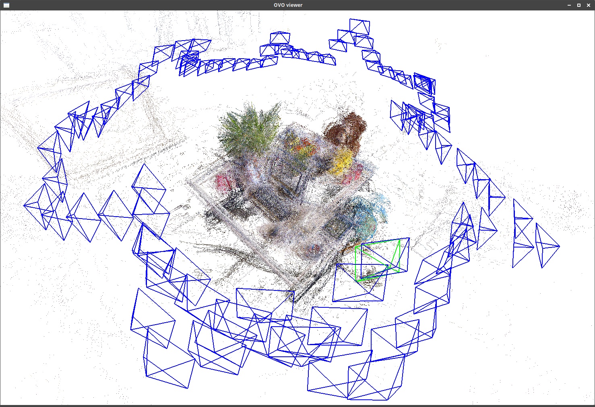
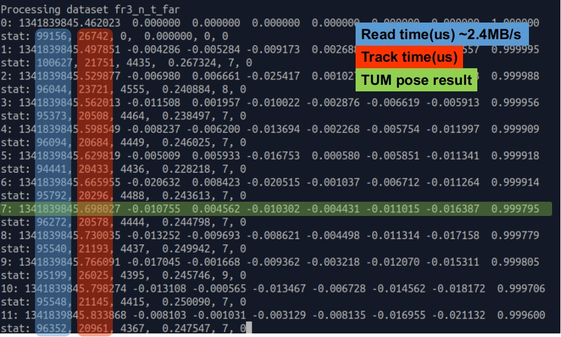

# PicoVO: Edge-based Visual Odometry for Microcontrollers


PicoVO (皮可VO) enables real-time RGB-D based 3D perspective on MCU/DSP platforms. It is an old-fashion optimization work for pose estimation.
- RGB-D and stereo (TODO) camera. **Currently it only simulates dataset with an SD Card**.
- Low runtime memory occupation: typically ~370kB .text and ~350kB .data that fits into the internal flash and SRAM of many MCUs.
- Real-time tracking speed: average **33fps@320x240 on STM32F767**.


The following image shows the tracking result of TUM fr2_desk [dataset](https://vision.in.tum.de/data/datasets/rgbd-dataset/download), tracked at **320x240** (QVGA) resolution using **fixed-point** Jacobian calculation in Levenberg-Marquard solver. Hereby no loop closure is performed.



---

## 0. License

PicoVO is licensed under GPLv3. :dog:

## 1. Prerequisites

Operating System: Ubuntu etc. or docker. Tested on Ubuntu 20.04 (OpenCV 4.2.0).

PicoVO has two ports: `desktop PC` and `STM32F767`. The MCU port targets [NUCLEO-F767ZI](https://www.st.com/en/evaluation-tools/nucleo-f767zi.html), and it wraps the STM32CubeMX project into a cmake project.

PC port:
- cmake
- OpenCV 4: libopencv-dev python-opencv
- Eigen3: libeigen3-dev

STM32F767 port:
- cmake
- GNU toolchain: download from [ARM developer](https://developer.arm.com/tools-and-software/open-source-software/developer-tools/gnu-toolchain/gnu-rm/downloads). Tested `gcc-arm-none-eabi-9-2020-q2-update`
- openocd
- Eigen3 (since it is a header-only library)

> You may need to update udev rules to access stlink & /dev/ttyACMx without root priviledge.

> The Sophus library is integrated in this repository.

Datasets:
- RGB-D: download from [TUM dataset](https://vision.in.tum.de/data/datasets/rgbd-dataset/download)

One by one, extract the dataset and create the `associate.txt` using the `associate.py` from [TUM tools](https://vision.in.tum.de/data/datasets/rgbd-dataset/tools).

``` sh
python associate.py /PATH/TO/DATASET/rgb.txt /PATH/TO/DATASET/depth.txt > /PATH/TO/DATASET/associate.txt
```

## 2. Build and run PC port

Build with `cmake`. We deliberately separate builds with/without the Pangolin viewer to avoid IO overhead when benchmarking...

``` sh
mkdir build-pc
cd build-pc
# configure without viewer
cmake ..
## or configure with Pangolin OpenGL viewer
# cmake .. -DWITH_PANGOLIN_VIEWER=ON
make -j8
```

This will create `picovo` at the `build-pc` folder. Run `picovo` with the **configuration file** argument, e.g. [config-tum-dataset.yaml](config-tum-dataset.yaml) provided in this project. Configure the parameters just as their names imply, and refer to [picovo_config.h](src/picovo_config.h) for details.

```
./picovo ../config-tum-dataset.yaml
```

This outputs a bunch of pose files `poses-<dataset name>.txt` and `stat-<dataset name>.csv`. Use the `evaluate_rpe.py` from [TUM tools](https://vision.in.tum.de/data/datasets/rgbd-dataset/tools) for precision estimation. Statistic files can be opened with Excel, including: tracking time, number of tracked features, residual, optimization iterations.

To evaluate multiple results, use a `for` loop of shell script:

``` sh
for i in `ls poses*`
do 
    bn=`echo $i|sed -e 's/poses-\(.*\)\.txt/\1/'`
    echo $bn :
    /PATH/TO/evaluate_rpe.py /PATH/TO/$bn/groundtruth.txt $i --verbose --fixed_delta | grep rmse
    echo
done
```

## 3. Build and run MCU port

The MCU read/write to an SD card. The file examples are shown below:


### 3.1 build

Use a different build directory from the PC port, e.g. `build-mcu`:

``` sh
mkdir build-mcu
cd build-mcu
cmake ../src-mcu/
## Default: fixed-point LM. Configure floating-point as follows:
# cmake ../src-mcu/ -DUSE_FLOAT_SOLVER=ON
make -j8
```

This will create `picovo_cm7` and `picovo_cm7.bin` at the `build-mcu` folder.

### 3.2 SD card preparation
To run MCU port, first transform the datasets using [src-mcu/scripts/resize_raw.py](src-mcu/scripts/resize_raw.py) one by one. This script copies the `associate.txt` to the output folder, resizes all the images to 320x240 and gathers them in a raw binary blob `data.bin`.

```
src-mcu/scripts/resize_raw.py -i <dataset folder> -o <output folder>
```


Prepare an SD card and **format it into FAT32**. You may use `mkfs.vfat` in Linux.

Then, copy the transformed output folders to the SD card. Create `datasets.txt` file that each line notes one dataset folder. See also [src-mcu/run_tum.c](src-mcu/run_tum.c#L55).

Finally, connect the SD card and the board as follow:


### 3.3 update firmware
Plug in the `NUCLEO-F767ZI` board and flash the previously built firmware via `openocd`. Use the openocd script [src-mcu/scripts/st_nucleo_f7.cfg](src-mcu/scripts/st_nucleo_f7.cfg). You must launch 2 terminals in the following procedures.

First, launch openocd **at the project root** in the first terminal.

``` sh
openocd -f src-mcu/scripts/st_nucleo_f7.cfg
```

Second, launch a second terminal and telnet openocd:

``` sh
telnet localhost 4444
# Type the folling commands inside the openocd console.
# Note that hereby file paths are based on the working directory of
# the first terminal.
reset halt
flash write_image erase build-mcu/picovo_cm7.bin 0x08000000
```

The telnet console outputs as follows:

    Trying 127.0.0.1...
    Connected to localhost.
    Escape character is '^]'.
    Open On-Chip Debugger
    > reset halt
    target halted due to debug-request, current mode: Thread
    xPSR: 0x01000000 pc: 0x080089c4 msp: 0x20080000
    > flash write_image erase build-mcu/picovo_cm7.bin 0x08000000
    auto erase enabled
    device id = 0x10016451
    flash size = 2048kbytes
    Single Bank 2048 kiB STM32F76x/77x found
    target halted due to breakpoint, current mode: Thread
    xPSR: 0x61000000 pc: 0x20000046 msp: 0x20080000
    wrote 524288 bytes from file build-mcu/ovo_cm7.bin in 10.658219s (48.038 KiB/s)
    > 

Finally, reset and run by pressing the reset button on the board, or type `reset run` command in the telnet console. You may kill both terminals as long as you finish the download.

### 3.4 inspect logs

The MCU shall log to its default USART3 connected to the st-link, recognized as `/dev/ttyACM*` on Linux. Assume it is ttyACM0, simply `cat /dev/ttyACM0` and see the log message. Alternatively you may also prefer serial terminals like `picocom` or `minicom` to access it.

The log contains pose and statistics, including reading time, tracking time, residual, iterations etc. See also [src-mcu/run_tum.c](src-mcu/run_tum.c#L157).




### 3.4 inspect results

The MCU writes results to the SD card:
- Poses, named after `poses-<dataset>.txt`
- Statistics, named after `stat-<dataset>.csv`


These files are not flushed during processing. So be patient while the MCU is still running...

The processing speed may be slow due to file read and write. In my experience the SDIO CLK@12MHz would take around 95ms to read 230KB (or 2.4MB/s), **and this throttles the overall tracking speed to around 6.5fps!** Nevertheless, the "real" tracking time measured in the statistic file covers both image preprocessing and tracking, and we deliberately add compiler barriers to avoid being optimized out:

``` c
// run_tum.c:135
// Compiler barrier for true timer measurement
#define BARRIER asm volatile("": : :"memory")
BARRIER;
uint32_t start_tim = htim2.Instance->CNT;
BARRIER;
track_frame_rgbd(pgray, pdepth);
BARRIER;
uint32_t end_tim = htim2.Instance->CNT;
BARRIER;
```

### 3.5 debug

First, launch openocd in the first terminal as previously described.

Second, launch `arm-none-eabi-gdb` in a second terminal inside `src-mcu/scripts/` using the script [gdbinit](src-mcu/scripts/gdbinit):

```
arm-none-eabi-gdb -x gdbinit ../../build-mcu/picovo_cm7
```

Now you can debug it with common gdb commands. [TUI](https://sourceware.org/gdb/onlinedocs/gdb/TUI.html) (GDB Text User Interface) is recommended in cli environment.

Hints:
- reset: `monitor reset halt`
- reset and run without gdb capturing: `monitor reset run`
- load current firmware: `load`
- update new firmware: `ldnew` which is provided in the gdbinit script


## 4. FAQ

1. Why doesn't it **seem** to be that fast?
- Because this is a single-thread design, and most of the time is spent on input/output, specifically, `cv::imread()`, `cv::imshow()`. Using the Pangolin viewer also poses a synchronization barrier between the main thread and the viewer thread, which means that the more points it displays, the slower it will be. See also `tracker_rgbd::_track_curr_frame()`.

2. Why does it sometimes seems to halt?
- You might be reading dataset from a slow HD drive or USB drive. Track it a second time immediately after the first try (so that the previous files are cached in system RAM). Alternatively you may upgrade to an SSD drive, or copy the dataset to `/tmp/` folder for fast tmpfs IO.

3. Why do the tracking results to the same dataset vary in different execution?
- On PC, the calculation order of floating-point operations may not be identical in different compilation and execution. In my experience, even if I only delete some lines of comment in my source, the tracking result varies after recompiling. The MCU doesn't seem to have such issue.

4. Are there any "real world" applications of PicoVO?
- Not yet. PicoVO is still a preliminary work. :joy: We welcome for collaborators. Please email us over {heyuquan20b, wangying2009, liucheng, zlei} at ict dot ac dot cn.